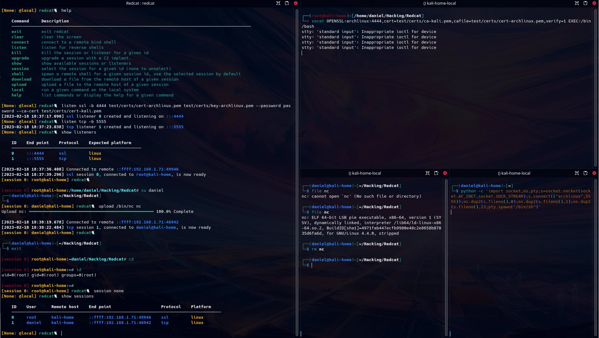

# Redcat

A remote shell handler implemented in python for CTFs, pentest and red team engagements.

## Features:
* A session manager for handling mutiple listeners and shells at once.
* Bind and reverse shells support.
* TCP and SSL/TLS protocols support.
* IPv4 and IPv6 support.
* Fully interactive pty shell for Linux hosts.
* Basic data exfiltration for file download and upload.
* Limited windows support (no pty).
* Internal command-line completion.

